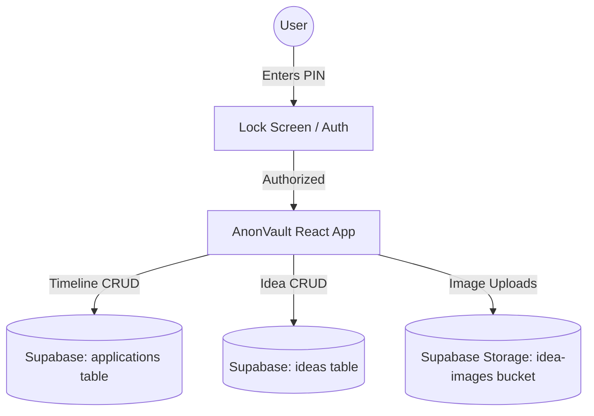

# High-Level Design (HLD): AnonVault

This document provides a simple, high-level overview of AnonVault's architecture, data flows, and system components.

---

## System Architecture Overview

AnonVault is a client-first, secure web application designed to track application deadlines and catalog ideas. It interfaces directly with a Supabase cloud database, meaning your data stays private and synchronizes automatically.



---

## Core System Components

The table below explains what each block in our system does:

| Component | Responsibility | Tech Stack |
| :--- | :--- | :--- |
| **Lock Screen Gate** | Prevents unauthorized layout views. Matches inputs against environment variables. | React + SessionStorage |
| **Timeline Tracker** | Displays, filters, and sorts project/job applications chronologically. | React + Lucide Icons |
| **Idea Vault** | Formats captured thoughts in a masonry grid, supporting tags and attachments. | React + Lucide Icons |
| **Supabase Client API** | Manages remote connections, authentication headers, and read/write payloads. | `@supabase/supabase-js` |
| **Database Engines** | Relational storage for task deadlines, metadata, and idea rows. | Supabase (PostgreSQL) |
| **Cloud Storage** | Stores uploaded images and serves them via public URLs. | Supabase Storage Buckets |

---

## Core Data Flows

### 1. Security Authorization Flow
When a user launches or refreshes the application:

```
[User Interface]                [SessionStorage]              [Environment Config]
       |                                |                              |
       |--- 1. Check Auth Status? ------->|                              |
       |    (Not authorized yet)        |                              |
       |                                |                              |
       |--- 2. Request PIN Code -------->|                              |
       |    (User enters passcode)      |                              |
       |                                |                              |
       |--- 3. Compare with Env? ------------------------------------->|
       |    (Check PIN matches 2004)    |                              |
       |                                |                              |
       |<-- 4. Passcode Matches! --------|                              |
       |                                |                              |
       |--- 5. Save Auth State -------->|                              |
       |    ("minianon_authorized=true")|                              |
       |                                |                              |
       |=== 6. Render Dashboard ===     |                              |
```

### 2. Application and Ideas Synchronization Flow
Once unlocked, the application interacts directly with your PostgreSQL database:

```
[AnonVault Front-End]                     [Supabase API Layer]                [PostgreSQL Database]
        |                                          |                                    |
        |--- 1. Fetch all records ---------------->|                                    |
        |                                          |--- 2. Query SELECT * ------------->|
        |                                          |<-- 3. Return Rows -----------------|
        |<-- 4. Sort and render chronologically ---|                                    |
        |                                          |                                    |
        |=== User adds new record ===              |                                    |
        |                                          |                                    |
        |--- 5. Insert Application / Idea -------->|                                    |
        |                                          |--- 6. Query INSERT INTO ---------->|
        |                                          |<-- 7. Return Confirmation Row -----|
        |<-- 8. Append to UI state & sort ---------|                                    |
```

---

## Security Specifications

* **Environment Gating**: The decryption PIN resides strictly in your host environment (`.env`) as `VITE_APP_PIN`. No fallback strings are compiled in the source files.
* **Database Row Level Security (RLS)**: PostgreSQL rules ensure that even if API keys are public, operations remain bound to secure table constraints.
