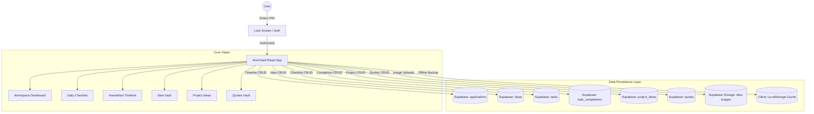

# High-Level Design (HLD): AnonVault

This document provides a high-level overview of AnonVault's architecture, data flows, and system components.

---

## System Architecture Overview

AnonVault is a client-first, secure web application built with React + Vite. It interfaces directly with a Supabase cloud database, with an offline-first LocalStorage fallback. The entire workspace is gated behind a 4-digit PIN lock screen.



---

## Core System Components

| Component | Responsibility | Tech Stack |
| :--- | :--- | :--- |
| **Lock Screen Gate** | Prevents unauthorized access. Integrates a minimalist PIN keypad with shake animation on failure. | React + SessionStorage |
| **Workspace Dashboard** | The pinned home view. Aggregates daily quote, task progress, hackathon snapshot, pinned concepts, and project drafts. Includes a live `HH:MM:SS` clock and date pill in the header. | React + Lucide Icons |
| **Checklist Manager** | Organizes daily tasks and recurring/weekday subtasks. Dashboard shows a live progress bar and scrollable task snapshot. | React + Lucide Icons |
| **Timeline Tracker** | Displays, filters, and sorts hackathon applications chronologically. Dashboard shows the closest starred event. | React + Lucide Icons |
| **Idea Vault** | Masonry grid of concept cards with tags and attachments. Dashboard shows top pinned ideas. | React + Lucide Icons |
| **Project Concepts** | Drag-to-reorder sandbox cards. Dashboard shows pinned drafts. | React + Lucide Icons |
| **Quotes Vault** | Personal quote library. One quote rotates daily on the dashboard via deterministic date-hash modulus. | React |
| **Sidebar Navigation** | Global navigation with per-section color accents. Dashboard icon has a glowing pin badge. Footer includes X, GitHub, and LinkedIn links with hover tooltips. | React + Lucide Icons |
| **Supabase Client API** | Manages remote connections, CRUD payloads, and fallback caches. | `@supabase/supabase-js` |
| **Cloud Storage** | Stores uploaded images and serves them via public URLs. | Supabase Storage Buckets |

---

## Core Data Flows

### 1. Security Authorization & Daily Quote Flow

```
[User Interface]             [SessionStorage]        [Date-Hash Generator]
       |                            |                         |
       |--- 1. Check Auth? -------->|                         |
       |    (Not authorized yet)    |                         |
       |--- 2. Show PIN Keypad      |                         |
       |    (User enters 4 digits)  |                         |
       |--- 3. Fetch Daily Quote --------------------------->|
       |    (Locks in stable daily quote via date % n)        |
       |<-- 4. PIN Matches! ---------|                        |
       |--- 5. Save Auth State ----->|                        |
       |    ("minianon_authorized=true")                      |
       |=== 6. Render Dashboard ===  |                        |
```

### 2. Dual-Engine Synchronization Flow

```
[AnonVault Front-End]                  [Supabase API Layer]         [PostgreSQL]
        |                                       |                        |
        |--- 1. Fetch all records ------------->|                        |
        |    (Falls back to LocalStorage cache) |--- 2. SELECT * ------->|
        |                                       |<-- 3. Return Rows -----|
        |<-- 4. Sync state & render ------------|                        |
        |                                       |                        |
        |=== User adds/edits record ===         |                        |
        |                                       |                        |
        |--- 5. INSERT/UPDATE + cache update -->|                        |
        |                                       |--- 6. Write to DB ---->|
        |                                       |<-- 7. Confirm Row -----|
        |<-- 8. Append to UI state -------------|                        |
```

---

## Security Specifications

- **Environment Gating**: The PIN resides strictly in `.env` as `VITE_APP_PIN`. No fallback strings are compiled into source files.
- **Database Row Level Security (RLS)**: PostgreSQL rules ensure operations remain bound to secure table constraints.
- **Local Storage Limits**: Image uploads are capped at 1.5MB to preserve local memory capacity during fallback cache updates.
- **Session Gating**: Authorization state is stored in `SessionStorage` — cleared on browser close, requiring re-authentication each session.
