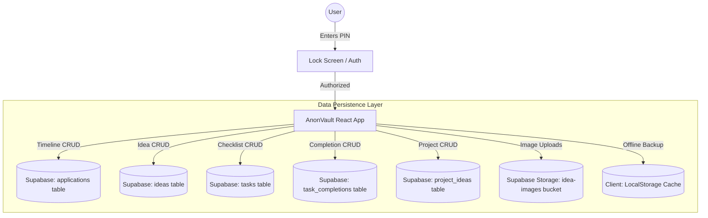

# High-Level Design (HLD): AnonVault

This document provides a simple, high-level overview of AnonVault's architecture, data flows, and system components.

---

## System Architecture Overview

AnonVault is a client-first, secure web application designed to track application deadlines, manage daily checklists, catalog ideas, and brainstorm project concepts. It interfaces directly with a Supabase cloud database, with an offline-first LocalStorage fallback to ensure your data stays private and synchronizes automatically under any network state.



---

## Core System Components

The table below explains what each block in our system does:

| Component | Responsibility | Tech Stack |
| :--- | :--- | :--- |
| **Lock Screen Gate** | Prevents unauthorized layout views. Integrates a minimalist "Today's Quote" widget styled with geometric/serif fonts and modulus date-hash logic. | React + SessionStorage |
| **Checklist Manager** | Organizes daily tasks and recurring/weekday subtasks, mapping state counts to a dynamic, visual sidebar overview. | React + Lucide Icons |
| **Timeline Tracker** | Displays, filters, and sorts project/job applications chronologically. | React + Lucide Icons |
| **Idea Vault** | Formats captured thoughts in a masonry grid, supporting tags and attachments. | React + Lucide Icons |
| **Project Concepts** | Captures sandbox brainstorm concepts, fully aligned to the Indigo/Blue theme and manual sort-order. | React + Lucide Icons |
| **Supabase Client API** | Manages remote connections, authentication headers, and CRUD payloads with fallback caches. | `@supabase/supabase-js` |
| **Database Engines** | Relational storage for task deadlines, metadata, and idea rows. | Supabase (PostgreSQL) |
| **Cloud Storage** | Stores uploaded images and serves them via public URLs. | Supabase Storage Buckets |

---

## Core Data Flows

### 1. Security Authorization & Stable Quote Flow
When a user launches or refreshes the application:

```
[User Interface]                [SessionStorage]              [Date-Hash Generator]
       |                                |                              |
       |--- 1. Check Auth Status? ------->|                              |
       |    (Not authorized yet)        |                              |
       |                                |                              |
       |--- 2. Request PIN Code -------->|                              |
       |    (User enters passcode)      |                              |
       |                                |                              |
       |--- 3. Fetch Modulus Quote ----------------------------------->|
       |    (Locks in stable daily Lora quote)                         |
       |                                |                              |
       |<-- 4. Passcode Matches! --------|                              |
       |                                |                              |
       |--- 5. Save Auth State -------->|                              |
       |    ("minianon_authorized=true")|                              |
       |                                |                              |
       |=== 6. Render Dashboard ===     |                              |
```

### 2. Dual-Engine Synchronization Flow
Once unlocked, the application interacts with both Supabase and LocalStorage to prevent offline-state crashes:

```
[AnonVault Front-End]                     [Supabase API Layer]                [PostgreSQL Database]
        |                                          |                                    |
        |--- 1. Fetch all records ---------------->|                                    |
        |    (If connection fails, run fallback)   |--- 2. Query SELECT * ------------->|
        |                                          |<-- 3. Return Rows -----------------|
        |<-- 4. Sync state, sort, & render --------|                                    |
        |                                          |                                    |
        |=== User adds new record ===              |                                    |
        |                                          |                                    |
        |--- 5. Insert Row & Update Cache -------->|                                    |
        |                                          |--- 6. Query INSERT INTO ---------->|
        |                                          |<-- 7. Return Confirmation Row -----|
        |<-- 8. Append to UI state & re-order -----|                                    |
```

---

## Security Specifications

* **Environment Gating**: The decryption PIN resides strictly in your host environment (`.env`) as `VITE_APP_PIN`. No fallback strings are compiled in the source files.
* **Database Row Level Security (RLS)**: PostgreSQL rules ensure that operations remain bound to secure table constraints. For personal vaults, users can choose to bypass RLS for ease of local development.
* **Local Storage Limits**: Image uploads are kept under 1.5MB to preserve local memory capacity during fallback cache updates.
